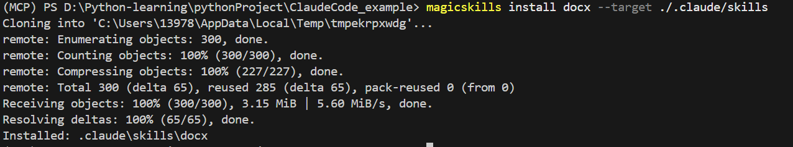
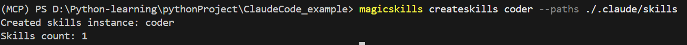
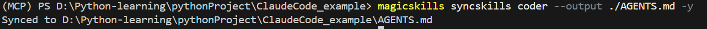
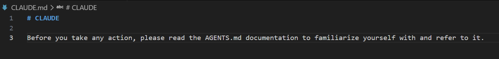
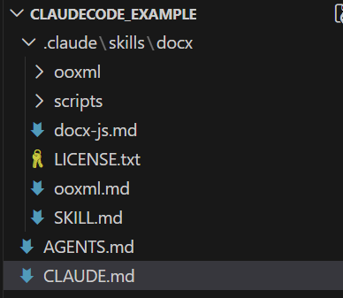
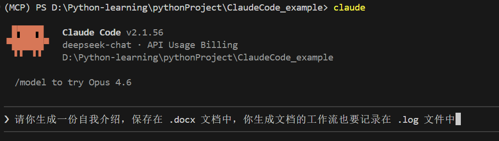
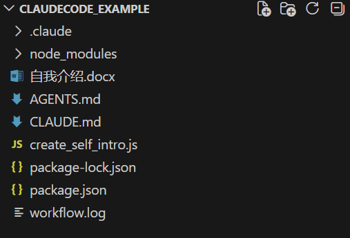

## 适配 Claude Code

首先 `git clone https://github.com/Narwhal-Lab/MagicSkills.git`

并执行  `pip install -e .` 指令

本文的示例 skill 以 **`docx`** 为例

打开你的 claude code 的工作目录，

### 安装 skill

执行 `magicskills install docx --target ./.claude/skills`

### 注册 skills

执行 `magicskills createskills coder --paths ./.claude/skills`

### 生成 AGETNS.md 

执行 `magicskills syncskills coder --output ./AGENTS.md -y`

或者直接 `magicskills syncskills coder -y`

### 创建 CLAUDE.md

由于 claude code 内定是使用 CLAUDE.md 文档，所以需要手动创建和编写 `Before you take any action, please read the AGENTS.md documentation to familiarize yourself with and refer to it.` 到其中

最后应有如下文件

### 使用

配置好上述文件后，claude code 就具备了生成 docx 文档的能力

例如你可以输入： “请你生成一份自我介绍，保存在 .docx 文档中，你生成文档的工作流也要记录在 .log 文件中 ”

### 结果如下

