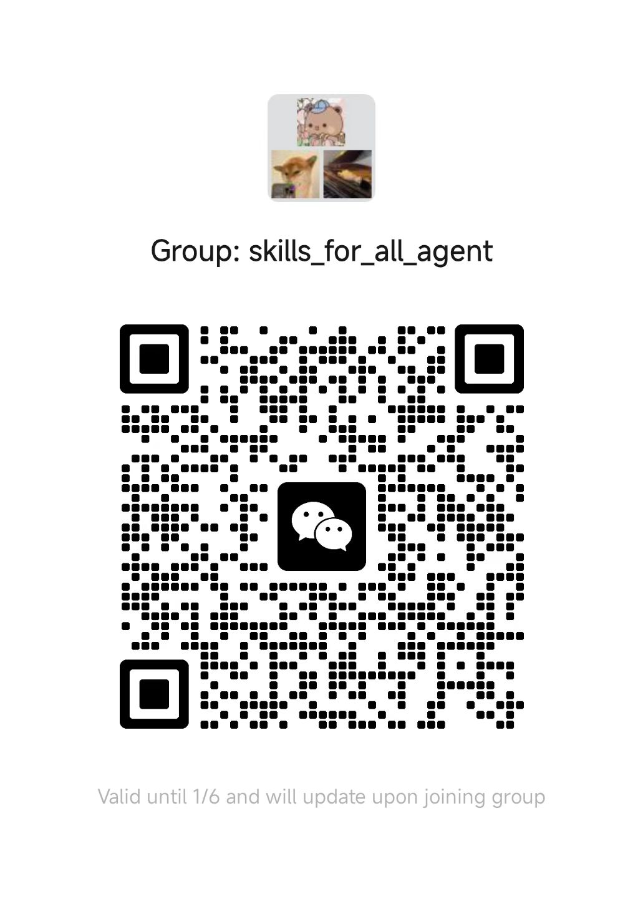

# skills-for-all-agent

面向各类 Agent 的 Skill 运行器。提供统一的 `skill_tool` 函数，
用于 Skills 的元数据发现、SKILL.md 读取、资源加载与脚本执行，便于
接入 function calling 或 tool-calling 生态。

## 优点

1. 无缝兼容所有模型
2. 建立在传统框架技术上
3. 只需要pip3 install skills_for_all_agent 并提供给大模型一个接口即可让大模型使用skill

## 亮点

- 元数据扫描并拼接成提示词块
- 按需加载 SKILL.md（progressive disclosure）
- 安全读取 skill 内部资源文件
- 受控执行脚本并返回 stdout/stderr

## 适用场景

- 实现 Claude/DeepAgents/AgentScope 风格的 Skill 机制
- 多框架适配（只需暴露一个工具函数）
- 在 Agent 层做统一的技能编排与权限控制

## 安装

本地可编辑安装：

```bash
pip install -e /root/LLK/skills_for_all_agent
```

## 快速开始

```python
from skills_for_all_agent import skill_tool

result = skill_tool({"action": "list_metadata"})
print(result["prompt"])
```

## API 概览

所有调用都通过一个 dict 输入：

```python
skill_tool({
  "action": "list_metadata",
  "skills_root": "~/.skills"
})
```

支持的 action：

- `list_metadata` -> 返回 `skills` 和 `prompt`
- `get_skill_body` -> 需要 `skill_name`
- `read_resource` -> 需要 `skill_name` 和 `path`
- `run_script` -> 需要 `skill_name` 和 `path`，可选 `args`

## LangChain 示例

见 `langchain_example/`，包含：

- Qwen-Max (DashScope) 真实 LLM 例子
- StructuredTool 封装
- Agent 调用流程

环境变量：

- `DASHSCOPE_API_KEY` 用于 Qwen-Max

## 技能目录约定

```
~/.skills/
  my-skill/
    SKILL.md
    scripts/
    references/
    assets/
```

## 项目结构

```
skills_for_all_agent/
  skills_for_all_agent/
    skill_tool.py
  langchain_example/
    example.py
```

## 许可证

MIT License


## 后续安排

1. 提供前端页面用于自动化上传skill和保存skill到当前package，使得所有人只需要pip3 install skills_for_all_agent 就可以让自己的模型使用skill。从而建立起skill的完整生态
2. 尝试去接轨其他agent架构
3. 所有agent想要使用skill只需下载这个package就可以使用skill


如果有不足的地方想提供建议或者想一起参与的大佬。 请扫码加入微信群。欢迎大家一起交流！！！


