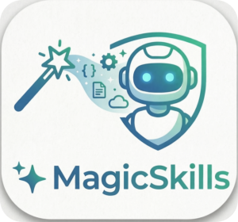

<div align="center">

<!-- 有 Logo 之后取消注释下行 -->

  

# MagicSkills

**Build skills once. Compose for every agent.**

为多 Agent 场景设计的 Skill 基础设施  
把零散的 `SKILL.md` 升级成可安装、可编排、可同步、可调用的能力系统

统一进入 `Allskills`（通过 `ALL_SKILLS()` 访问）· 按 Agent 精确组装 `Skills` · 同步到 `AGENTS.md` 或直接暴露为 tool

兼容 `SKILL.md` · 一套 skill 库服务多个 Agent · CLI + Python API · 本地优先、结构透明

[](https://github.com/Narwhal-Lab/MagicSkills)
[](https://opensource.org/licenses/MIT)
[](https://github.com/Narwhal-Lab/MagicSkills)

[Overview](#overview) · [Quick Start](#quick-start) · [How It Works](#how-it-works) · [CLI](#cli) · [Python API](#python-api) · [Tips](#tips)

</div>

---

## Overview

MagicSkills is a local-first skill infrastructure layer for multi-agent projects.

It turns scattered `SKILL.md` directories into something you can:

- install into one shared skill pool
- compose into per-agent `Skills` collections
- sync into `AGENTS.md`
- expose as a tool through one stable API

The core model is simple:

- `Skill`: one concrete skill directory
- `ALL_SKILLS()`: access the current built-in `Allskills` view
- `Skills`: the subset an agent or workflow actually uses
- `SkillsRegistry`: named collections persisted across runs

MagicSkills is most useful when:

- you maintain multiple agents that should reuse one skill library
- you already have `SKILL.md` content but no install/selection workflow
- some agents read `AGENTS.md`, while others need direct tool integration
- you want skill management to stay transparent and file-based

## Why MagicSkills

Without a skill layer, multi-agent projects usually drift into one of these states:

- the same skill is copied into multiple agent folders and quickly diverges
- `SKILL.md` exists, but it is still just a document, not an operational unit
- every agent loads too many irrelevant skills
- `AGENTS.md`, prompt glue, and framework tools evolve independently
- changing frameworks means redoing the whole integration

MagicSkills solves that by separating:

- the total installed skill pool
- the subset each agent should actually see
- the persistence layer that stores named collections

## Quick Start

The shortest recommended workflow is:

1. Install MagicSkills.
2. Install one or more skills into the local pool.
3. Create a named `Skills` collection for one agent.
4. Sync that collection to `AGENTS.md` or expose it as a tool.

### 1. Install The Project

From source:

```bash
git clone https://github.com/Narwhal-Lab/MagicSkills.git
cd MagicSkills
python -m pip install -e .
magicskills -h
```

Or from PyPI:

```bash
pip install MagicSkills
magicskills -h
```

### 2. Install Skills

```bash
magicskills install anthropics/skills
```

By default, installed skills are copied into `./.claude/skills/` and then become discoverable from the built-in `Allskills` view.

### 3. Create One Agent Collection

```bash
magicskills createskills agent1_skills --skill-list pdf docx --agent-md-path /agent_workdir/AGENTS.md
```

This means:

- resolve `pdf` and `docx` from `Allskills`
- create a named collection called `agent1_skills`
- remember `/agent_workdir/AGENTS.md` as its default sync target

### 4. Sync To `AGENTS.md`

```bash
magicskills syncskills agent1_skills
```

If the target file already contains a skills section, it is replaced. If not, a new one is appended.

### 5. Or Use The Tool Interface Directly

For agents that do not read `AGENTS.md`, use the unified CLI tool entrypoint:

```bash
magicskills skill-tool listskill --name agent1_skills
magicskills skill-tool readskill --name agent1_skills --arg pdf
magicskills skill-tool execskill --name agent1_skills --arg "echo hello"
```

## Python Example

If you are integrating MagicSkills into an agent framework, keep the Python side minimal:

```python
import json

from langchain_core.tools import tool
from magicskills import ALL_SKILLS, Skills

skill_a = ALL_SKILLS().get_skill("pdf")
skill_b = ALL_SKILLS().get_skill("docx")

agent1_skills = Skills(
    name="agent1_skills",
    skill_list=[skill_a, skill_b],
)


@tool("_skill_tool", description=agent1_skills.tool_description)
def _skill_tool(action: str, arg: str = "") -> str:
    return json.dumps(agent1_skills.skill_tool(action, arg), ensure_ascii=False)
```

Use `syncskills` if your runtime consumes `AGENTS.md`. Use `skill_tool` or the Python API directly if it does not.

## Documentation Map

- [How It Works](#how-it-works): architecture and object model
- [CLI](#cli): command-by-command reference
- [Python API](#python-api): object and function reference
- [Tips](#tips): integration guidance

# How It Works

## 核心思想

MagicSkills 的核心不是“把一堆命令堆在一起”，而是把 skill 管理拆成三层稳定模型：

- `Skill`：描述一个单独的 skill 目录及其元数据
- `Skills`：描述一组可操作的 skills 集合
- `SkillsRegistry`：描述多个命名 skills 集合的注册、加载和持久化

CLI 和 Python API 都只是这三层能力的不同入口。无论你执行的是 `readskill`、`install`、`syncskills` 还是 `skill_tool`，最终都会落到同一套核心对象和命令实现上。

从推荐的运行流程看，MagicSkills 更接近下面这条链路：

1. 先通过 `install` 把相关 skill 安装到本地 skills 目录
2. 安装过程中，MagicSkills 会扫描这些 skill 目录，解析 `SKILL.md` frontmatter，并把它们构造成 `Skill`
3. 所有已安装并被发现的 skill，都会先汇总进入内置 `Allskills` 视图
4. 再通过 `ALL_SKILLS()` 或 `REGISTRY.get_skills("Allskills")` 从这个视图里挑选一部分 skill，组合成某个具体 agent 要使用的 `Skills` 集合
5. 最后把这个命名的 `Skills` 集合注册进 `SkillsRegistry`，并按需持久化、同步到 `AGENTS.md`

## Skill 层

在 MagicSkills 里，一个 skill 的最小成立条件很简单：它必须是一个目录，并且目录内存在 `SKILL.md`。

典型目录结构如下：

```text
demo-skill/
├── SKILL.md
├── references/
├── scripts/
└── assets/
```

其中：

- `SKILL.md` 是 skill 的入口说明文件，也是元数据来源
- `references/`、`scripts/`、`assets/` 是常见约定目录，不是强制要求

代码里，单个 skill 会被表示为一个 `Skill` 对象，核心字段包括：

- `name`：skill 名称，通常就是目录名
- `description`：从 `SKILL.md` frontmatter 中提取
- `path`：该 skill 的目录路径
- `base_dir`：该 skill 所在的 skills 根目录
- `source`：这个 skill 来自哪里，例如本地路径或 Git 仓库
- `is_global` / `universal`：用于标记它来自哪类安装位置

这一层解决的是“单个 skill 是什么”的问题，不负责管理整组 skill，也不负责持久化注册表。

围绕单个 skill 的常见能力有：

- `readskill`：读取某个 skill 的 `SKILL.md`
- `showskill`：查看 skill 目录下的完整文件内容
- `createskill_template`：创建标准 skill 骨架
- `createskill`：把一个已存在的 skill 目录注册进集合

## Skills 集合层

`Skills` 层解决的是“如何把多个 skill 组织成一个可操作的工作集合”。

一个 `Skills` 对象可以通过两种方式构建：

- 直接传入 `skill_list`
- 传入 `paths`，由系统自动扫描这些路径下的 skill 目录

构造完成后，这个集合就拥有统一的高层能力：

- `listskill()`：列出集合里的所有 skill
- `readskill(target)`：读取 skill 文件内容
- `showskill(target)`：展示完整 skill 内容
- `execskill(command, ...)`：执行命令并返回结构化结果
- `uploadskill(target)`：上传 skill 到默认仓库工作流
- `deleteskill(target)`：从集合中移除 skill；如果作用于 `Allskills`，还会删除磁盘目录
- `syncskills(output_path=None)`：把当前集合写入 `AGENTS.md`
- `skill_tool(action, arg="")`：以 tool function 风格统一分发 list/read/exec

这一层有两个关键设计：

- `Skills` 既支持按名称找 skill，也支持按路径找 skill；当名称重复时，路径是最终判定标准
- `Skills` 是运行时视图，不等于安装目录本身；同一个 skill 可以被多个命名集合引用

需要特别注意的是，`execskill()` 当前是在当前进程的工作目录中执行命令，而不是自动切换到 skill 目录执行。这意味着 MagicSkills 统一了执行入口，但不会偷偷改你的运行上下文。

## Registry 持久化层

`SkillsRegistry` 层解决的是“如何保存和恢复多个命名 skills 集合”。

这一层的职责包括：

- 维护全局注册表单例 `REGISTRY`
- 保证内置集合 `Allskills` 一直存在
- 创建、查询、删除命名 skills 集合
- 把集合信息写入 JSON 文件，并在后续重新加载

默认情况下，注册表存储在：

```text
~/.magicskills/collections.json
```

这里保存的不是每个 skill 的完整文件内容，而是集合恢复所需的最小信息：

- `paths`
- `tool_description`
- `agent_md_path`

也就是说，Registry 保存的是“集合配置”和“skill 路径引用”，而不是 skill 内容副本。真正的 skill 内容仍然在文件系统里。

这一层的典型工作流是：

1. 通过 `createskills` 创建一个命名集合
2. 通过 `saveskills` 或 `REGISTRY.saveskills()` 持久化
3. 通过 `loadskills` 或进程启动时的默认加载恢复这些集合
4. 通过 `syncskills` 把某个集合同步到目标 `AGENTS.md`

因此，Registry 层本质上是 MagicSkills 的“项目级配置中心”。`Skill` 定义单体，`Skills` 组织集合，`SkillsRegistry` 负责让这些集合在不同运行周期之间持续存在。

# CLI

安装完成后会暴露 `magicskills` 命令：

```bash
magicskills -h
magicskills <command> -h
```

下面的示例默认以 `bash/zsh` 为例；如果你使用 PowerShell，请按 PowerShell 的引号和转义规则调整命令。

## CLI 命令总览

| 命令                      | 使用场景                                     | 主要能力                                                   |
| ------------------------- | -------------------------------------------- | ---------------------------------------------------------- |
| `listskill`             | 查看当前内置技能集合里有哪些 skill           | 列出 skill 名称、描述、`SKILL.md` 路径                   |
| `readskill`             | 读取 skill 说明或任意本地文本文件            | 按 skill 名称或文件路径输出内容                            |
| `execskill`             | 在当前工作目录执行命令                       | 支持流式输出、JSON 输出、无 shell 模式、自定义 skills 路径 |
| `syncskills`            | 把命名 skills 集合同步进 `AGENTS.md`       | 生成或替换 `<skills_system>` 区块                        |
| `install`               | 从本地目录、Git 仓库或默认技能仓库安装 skill | 复制 skill 文件并注册到 `Allskills`                      |
| `createskill`           | 把一个现成的 skill 目录注册到 `Allskills`  | 不复制文件，只注册元数据                                   |
| `uploadskill`           | 把本地 skill 提交到默认 MagicSkills 仓库     | 自动走 fork、push、PR 流程                                 |
| `deleteskill`           | 删除一个 skill                               | 删除 skill 目录，并从其他集合中剔除同路径 skill            |
| `showskill`             | 审查一个 skill 的完整内容                    | 显示元信息和 skill 目录下所有文件内容                      |
| `createskills`          | 创建一个命名 skills 集合                     | 为 agent 或团队建立独立 skill 集合                         |
| `listskills`            | 查看所有命名 skills 集合                     | 普通文本或 JSON 输出                                       |
| `deleteskills`          | 删除一个命名 skills 集合                     | 只删除集合注册，不删除 skill 文件                          |
| `changetooldescription` | 修改集合的 `tool_description` 元数据       | 更新集合描述，便于后续查询与外部集成                       |
| `skill-tool`            | 以 tool function 风格调用 skill 能力         | 用统一 JSON 输出做 list/read/exec 分发                     |

## 通用约定

- `Allskills` 是内置 skills 集合。`listskill`、`readskill`、`install`、`createskill`、`uploadskill`、`deleteskill`、`showskill` 默认都围绕它工作。
- 命名 skills 集合通过 `createskills` 创建，集合元数据保存在 `~/.magicskills/collections.json`。
- 很多命令同时接受 `skill 名称` 和 `skill 目录路径`。如果同名 skill 有多个，必须传显式路径。
- `install` 的默认安装目录由作用域决定。
- 当前项目默认目录：`./.claude/skills`
- `--global` 默认目录：`~/.claude/skills`
- `--universal` 当前项目目录：`./.agent/skills`
- `--global --universal` 目录：`~/.agent/skills`
- `readskill` 读取 skill 名称时，实际读取的是该 skill 目录下的 `SKILL.md`。
- `execskill` 推荐用 `--` 把 CLI 参数和待执行命令分开。

## `listskill`

**使用场景**

想快速查看当前 `Allskills` 里已经注册了哪些 skill，以及每个 skill 的基础说明。

**命令格式**

```bash
magicskills listskill
```

**参数说明**

无。

**功能示例**

```bash
magicskills listskill
```

输出会按顺序列出每个 skill 的：

- `name`
- `description`
- `path`（指向该 skill 的 `SKILL.md`）

## `readskill`

**使用场景**

你已经知道某个 skill 名称，想直接查看它的 `SKILL.md`；或者你想借这个命令顺手读取任意一个本地文件。

**命令格式**

```bash
magicskills readskill <path>
```

**参数说明**

- `<path>`：可以是文件路径，也可以是 `Allskills` 中的 skill 名称。
- 当传入 skill 名称时，命令会读取对应 skill 目录下的 `SKILL.md`。
- 当传入的是显式路径时，目标必须是文件，不能是目录。
- 如果同名 skill 有多个，必须改传具体文件路径，例如 `./skills/demo/SKILL.md`。

**功能示例**

按 skill 名称读取：

```bash
magicskills readskill demo
```

按 `SKILL.md` 文件路径读取：

```bash
magicskills readskill ./skills/demo/SKILL.md
```

读取任意本地文件：

```bash
magicskills readskill ./AGENTS.md
```

同名 skill 冲突时，改为显式路径：

```bash
magicskills readskill ./vendor-skills/demo/SKILL.md
```

## `execskill`

**使用场景**

你希望在当前工作目录执行一条命令，同时保持调用方式和 MagicSkills 体系一致；也适合给 agent 或自动化脚本暴露统一的执行入口。

**命令格式**

```bash
magicskills execskill [--no-shell] [--json] [--paths [PATHS ...]] -- <command>
```

**参数说明**

- `<command>`：要执行的命令字符串。建议写在 `--` 后面。
- `--no-shell`：关闭 shell 模式，内部会对命令做 `shlex.split()`，更适合直接执行可执行文件及其参数。
- `--json`：不直接流式打印终端输出，而是返回 JSON，字段包含 `command`、`returncode`、`stdout`、`stderr`。
- `--paths [PATHS ...]`：指定自定义 skill 搜索路径，用这些路径构造临时 `Skills` 集合后再执行命令。

**功能示例**

默认流式执行：

```bash
magicskills execskill -- pwd
```

返回 JSON 结果，便于脚本消费：

```bash
magicskills execskill --json -- echo hello
```

无 shell 模式执行 Python：

```bash
magicskills execskill --no-shell -- python -c 'print(123)'
```

在自定义 skills 路径上下文中执行命令：

```bash
magicskills execskill --paths ./.claude/skills ./vendor-skills -- ls -la
```

## `syncskills`

**使用场景**

你已经创建了一个命名 skills 集合，想把它同步到某个 `AGENTS.md` 文件里，让 agent 在系统提示中感知这些 skills。

**命令格式**

```bash
magicskills syncskills <name> [-o OUTPUT] [-y]
```

**参数说明**

- `<name>`：命名 skills 集合名称。
- `-o, --output`：输出文件路径；不传时使用该集合自己的 `agent_md_path`。
- `-y, --yes`：跳过交互确认，直接同步。

**功能示例**

同步到集合默认的 `agent_md_path`：

```bash
magicskills syncskills coder
```

同步到指定文件：

```bash
magicskills syncskills coder --output ./AGENTS.md
```

在 CI 或脚本中跳过确认：

```bash
magicskills syncskills coder -o ./AGENTS.md -y
```

补充说明：

- 如果目标文件不存在，命令会先创建文件并写入基础 `# AGENTS` 标题。
- 如果文件里已存在 `<skills_system>` 区块，命令会替换它；否则会把新块追加到文件末尾。

## `install`

**使用场景**

你想把 skill 安装到当前项目或全局目录中。这个命令既支持安装一个默认仓库里的指定 skill，也支持安装一个本地目录或远程 Git 仓库中的全部 skills。

**命令格式**

```bash
magicskills install <source> [--global] [--universal] [-t TARGET] [-y]
```

**参数说明**

- `<source>`：支持四种输入形式。
- skill 名称：例如 `demo`。命令会克隆默认仓库 `https://github.com/Narwhal-Lab/MagicSkills.git`，只安装同名 skill。
- GitHub 仓库短写：例如 `owner/repo`。命令会转成 `https://github.com/owner/repo.git` 并安装仓库内所有包含 `SKILL.md` 的 skill 目录。
- Git URL：例如 `https://github.com/owner/repo.git` 或 `git@github.com:owner/repo.git`。
- 本地路径：可以是单个 skill 目录，也可以是包含多个 skill 的根目录；命令会递归查找所有 `SKILL.md`。
- `--global`：把安装根目录切到用户 Home，而不是当前项目目录。
- `--universal`：把安装目录从 `.claude/skills` 切到 `.agent/skills`。
- `-t, --target`：自定义安装目录；不能和 `--global` 或 `--universal` 同时使用。
- `-y, --yes`：如果目标目录中已经存在同名 skill，直接覆盖。

**解析顺序**

- 如果 `<source>` 在本地存在，按本地路径处理。
- 如果 `<source>` 看起来像普通 skill 名称且不包含 `/`、`\\`、`.git` 或 URL 前缀，按默认仓库中的 skill 名称处理。
- 其他情况按 Git 仓库处理。

**功能示例**

安装默认 MagicSkills 仓库中的单个 skill：

```bash
magicskills install demo
```

从本地 skills 根目录批量安装：

```bash
magicskills install ./skills
```

从单个本地 skill 目录安装：

```bash
magicskills install ./skills/demo
```

从 GitHub 仓库短写安装：

```bash
magicskills install Narwhal-Lab/MagicSkills
```

从完整 Git URL 安装：

```bash
magicskills install https://github.com/owner/repo.git
```

安装到全局 `.claude/skills`：

```bash
magicskills install demo --global
```

安装到当前项目 `.agent/skills`：

```bash
magicskills install demo --universal
```

安装到自定义目录：

```bash
magicskills install demo --target ./custom-skills
```

覆盖同名 skill：

```bash
magicskills install demo --target ./custom-skills -y
```

补充说明：

- 远程安装依赖 `git`。
- 安装完成后，CLI 会输出每个实际落盘的目录路径。
- 安装流程会把已安装的 skill 注册进当前进程中的 `Allskills` 集合。

## `createskill`

**使用场景**

你已经手写好了一个 skill 目录，只想把它注册进 `Allskills`，而不是重新复制一份。

**命令格式**

```bash
magicskills createskill <path> [--source SOURCE]
```

**参数说明**

- `<path>`：skill 目录路径，目录内必须包含 `SKILL.md`。
- `--source`：可选，给这个 skill 记录来源信息；不传时默认记录 skill 所在父目录的绝对路径。

**功能示例**

注册一个本地 skill 目录：

```bash
magicskills createskill ./skills/my-skill
```

显式记录来源仓库或来源目录：

```bash
magicskills createskill ./skills/my-skill --source https://github.com/owner/repo.git
```

补充说明：

- 这个命令的行为是“注册已有 skill”，不是“生成 skill 模板”。
- `description` 会从 `SKILL.md` frontmatter 中提取。

## `uploadskill`

**使用场景**

你已经在本地准备好了一个 skill，想把它自动提交到默认 MagicSkills 仓库，并创建 Pull Request。

**命令格式**

```bash
magicskills uploadskill <source>
```

**参数说明**

- `<source>`：可以是 `Allskills` 中的 skill 名称，也可以是本地 skill 目录路径。

**默认工作流**

- 校验 `source` 对应目录存在且包含 `SKILL.md`。
- 检查 `gh` 是否已安装、是否已登录。
- `gh repo fork Narwhal-Lab/MagicSkills --clone`
- 拉取上游默认分支并创建新分支，分支名格式类似 `fix/upload-<skill>-<timestamp>`
- 把 skill 复制到仓库内的 `skills/<skill-name>`
- 提交、推送并创建 PR

**功能示例**

按 skill 名称上传：

```bash
magicskills uploadskill demo
```

按本地路径上传：

```bash
magicskills uploadskill ./skills/demo
```

补充说明：

- 如果同名 skill 在 `Allskills` 中有多个，必须改传 skill 目录路径。
- 在交互式终端里，如果 `gh` 缺失，CLI 会询问是否尝试自动安装；如果 `gh` 未登录，会询问是否运行 `gh auth login`。
- 如果 `gh auth login` 不方便执行，CLI 还会询问是否临时输入 `GH_TOKEN`。
- 成功后会输出 `Repo`、`Branch`、`Target`、`Committed`、`Pushed`、`PR URL` 等结果字段。

## `deleteskill`

**使用场景**

你想彻底删除一个 skill，而不只是把它从某个列表里隐藏。

**命令格式**

```bash
magicskills deleteskill <target>
```

**参数说明**

- `<target>`：可以是 skill 名称，也可以是 skill 目录路径。

**功能示例**

按名称删除：

```bash
magicskills deleteskill demo
```

同名 skill 冲突时按路径删除：

```bash
magicskills deleteskill ./skills/demo
```

补充说明：

- 这个 CLI 命令默认作用于内置的 `Allskills`。
- 删除时会直接移除实际 skill 目录，不会二次确认。
- 删除成功后，如果其他命名集合里也引用了同一路径的 skill，这些集合中的对应项也会一起被剔除。

## `showskill`

**使用场景**

你想完整审查一个 skill 包，而不只是看 `SKILL.md`。例如在 code review、提交流程、排查二进制文件或检查脚本入口时很有用。

**命令格式**

```bash
magicskills showskill <target>
```

**参数说明**

- `<target>`：可以是 skill 名称，也可以是 skill 目录路径。

**功能示例**

按名称查看：

```bash
magicskills showskill demo
```

按路径查看：

```bash
magicskills showskill ./skills/demo
```

补充说明：

- 输出会先展示 `Skill Overview`，包括名称、描述、skill 目录、base_dir、`SKILL.md` 路径和安装来源。
- 然后会展示 skill 目录下的所有文件内容。
- 如果遇到二进制文件，会显示 `[binary file omitted: <size> bytes]`，不会直接打印乱码。

## `createskills`

**使用场景**

你需要给某个 agent、团队或工作流创建一个独立的命名 skills 集合，再配合 `syncskills` 生成对应的 `AGENTS.md`。

**命令格式**

```bash
magicskills createskills <name> [--skill-list [SKILLS ...]] [--paths [PATHS ...]] [--tool-description TEXT] [--agent-md-path PATH]
```

**参数说明**

- `<name>`：新集合名称，必须唯一。
- `--skill-list [SKILLS ...]`：显式指定要纳入集合的 skill。每一项都可以是 skill 名称或 skill 目录路径，底层会从 `Allskills` 里解析。
- `--paths [PATHS ...]`：把这些路径对应的 skills 纳入新集合。常见传法有两种。
- 传某个 skill 目录路径，例如 `./.claude/skills/demo`
- 传某个 skills 根目录，例如 `./.claude/skills`
- `--tool-description`：覆盖该集合的 `tool_description` 元数据。
- `--agent-md-path`：指定该集合默认同步到哪个 `AGENTS.md` 文件。

**功能示例**

创建一个空集合：

```bash
magicskills createskills coder
```

按显式 skill 列表创建：

```bash
magicskills createskills reviewer --skill-list demo code-review
```

按显式 skill 路径创建：

```bash
magicskills createskills reviewer --skill-list ./.claude/skills/code-review
```

从一个 skills 根目录构造集合：

```bash
magicskills createskills coder --paths ./.claude/skills
```

只纳入一个具体 skill：

```bash
magicskills createskills reviewer --paths ./.claude/skills/code-review
```

同时指定多个路径：

```bash
magicskills createskills fullstack --paths ./.claude/skills ./vendor-skills
```

创建集合时顺带设置元数据：

```bash
magicskills createskills coder \
  --paths ./.claude/skills \
  --tool-description "Unified skill tool for coding tasks" \
  --agent-md-path ./agents/coder/AGENTS.md
```

补充说明：

- 不传 `--skill-list` 和 `--paths` 时，当前版本会创建一个空的命名集合。
- `--skill-list` 和 `--paths` 不能同时使用。
- `--skill-list` 中的每一项都必须能在当前 `Allskills` 中解析到唯一 skill；如果名称重复，请改传 skill 目录路径。
- `--paths` 中的路径需要能解析到当前 `Allskills` 里已有的 skills或其上层 skills 根目录。
- 成功后会输出集合名和 `Skills count`。

## `listskills`

**使用场景**

你想检查当前机器上已经注册了哪些命名 skills 集合，或者把这些集合信息交给脚本继续处理。

**命令格式**

```bash
magicskills listskills [--json]
```

**参数说明**

- `--json`：以 JSON 数组输出；不传时输出人类可读的盒状文本。

**功能示例**

查看所有集合：

```bash
magicskills listskills
```

以 JSON 形式输出：

```bash
magicskills listskills --json
```

JSON 输出中每个集合对象包含：

- `name`
- `skills_count`
- `paths`
- `tool_description`
- `agent_md_path`

## `deleteskills`

**使用场景**

某个命名 skills 集合已经不用了，你只想删除它的注册信息，但保留原始 skill 文件。

**命令格式**

```bash
magicskills deleteskills <name>
```

**参数说明**

- `<name>`：要删除的命名 skills 集合名称。

**功能示例**

删除一个命名集合：

```bash
magicskills deleteskills coder
```

补充说明：

- `deleteskills` 只删除集合注册信息，不会删除 skill 目录。
- 内置集合 `Allskills` 不能被删除。

## `changetooldescription`

**使用场景**

你想调整某个命名 skills 集合上的 `tool_description` 元数据，方便后续通过 `listskills --json`、Python API 或外部框架读取。

**命令格式**

```bash
magicskills changetooldescription <name> <description>
```

**参数说明**

- `<name>`：命名 skills 集合名称。
- `<description>`：新的工具描述文本；如果包含空格，记得加引号。

**功能示例**

更新描述：

```bash
magicskills changetooldescription coder "Unified skill tool for coding and review tasks"
```

更新后查看：

```bash
magicskills listskills --json
```

补充说明：

- 这会更新集合元数据。
- 它不会改变 `syncskills` 生成的固定 `AGENTS.md` usage 模板。

## `skill-tool`

**使用场景**

当你需要一个稳定的、面向 agent/tool-call 的 CLI 包装层时，使用这个命令最合适。它会把 `listskill`、`readskill`、`execskill` 统一成 JSON 返回结构，并用退出码表示成功或失败。

**命令格式**

```bash
magicskills skill-tool <action> [--arg ARG] [--name NAME]
```

**参数说明**

- `<action>`：动作名，支持以下主动作和别名。
- `listskill`、`list`、`list_metadata`
- `readskill`、`read`、`read_file`
- `execskill`、`exec`、`run_command`
- `--arg ARG`：动作参数。
- 对 `listskill` 基本可留空。
- 对 `readskill`，传 skill 名称或文件路径。
- 对 `execskill`，可传普通命令字符串、JSON 字符串，或旧格式 `name::command`。
- `--name NAME`：指定要使用哪个命名 skills 集合；不传时默认使用 `Allskills`。

**功能示例**

列出默认集合中的 skill：

```bash
magicskills skill-tool listskill
```

在指定命名集合里读取某个 skill：

```bash
magicskills skill-tool readskill --name coder --arg demo
```

读取显式文件路径：

```bash
magicskills skill-tool readskill --arg ./skills/demo/SKILL.md
```

执行普通命令字符串：

```bash
magicskills skill-tool execskill --arg "echo hello"
```

以 JSON 参数执行命令：

```bash
magicskills skill-tool execskill --arg '{"command":"echo hello"}'
```

兼容旧格式 `name::command`：

```bash
magicskills skill-tool execskill --arg 'demo::echo hello'
```

补充说明：

- 输出始终是 JSON。
- 当返回中 `ok` 为 `true` 时，CLI 退出码为 `0`；否则退出码为 `1`。
- 传入未知 action 时，会返回 `{"ok": false, "error": "Unknown action: ..."}`。

# Python API

如果你希望在脚本、测试、Agent runtime 或上层框架中直接调用 MagicSkills，而不是走 CLI，那么就使用 Python API。下面的内容以 `/root/LLK/MagicSkills/src/magicskills/__init__.py` 当前 `__all__` 为准。

```python
from pathlib import Path

from magicskills import (
    ALL_SKILLS,
    REGISTRY,
    Skills,
    listskill,
    readskill,
    execskill,
)
```

**导出分组**

- 类型：`Skill`、`Skills`、`SkillsRegistry`
- 访问器与常量：`REGISTRY`、`ALL_SKILLS()`、`DEFAULT_SKILLS_ROOT`
- 单 skill / 执行类函数：`listskill`、`readskill`、`showskill`、`execskill`、`createskill`、`createskill_template`、`install`、`uploadskill`、`deleteskill`
- skills 集合 / 注册表函数：`createskills`、`listskills`、`deleteskills`、`syncskills`、`loadskills`、`saveskills`
- 描述与分发函数：`change_tool_description`、`changetooldescription`、`skill_tool`

**使用建议**

- 如果你已经有 `Skills` 对象，优先调用实例方法，例如 `skills.readskill()`、`skills.execskill()`、`skills.syncskills()`。
- 如果你想直接复用 CLI 同名能力，使用顶层函数更直接。
- `changetooldescription` 是 `change_tool_description` 的兼容别名，两者等价。

## `Skill`

**使用场景**

当你需要手动构造一个 skill 元数据对象，或者想把 skill 元信息序列化给其他系统时使用。

**构造签名**

```python
Skill(
    name: str,
    description: str,
    path: Path,
    base_dir: Path,
    source: str,
    is_global: bool = False,
    universal: bool = False,
)
```

**参数说明**

- `name`：skill 名称，通常等于 skill 目录名。
- `description`：skill 简述，通常来自 `SKILL.md` frontmatter 的 `description`。
- `path`：skill 目录路径。
- `base_dir`：skill 所在的 skills 根目录。
- `source`：来源信息，例如本地路径、Git URL、仓库地址。
- `is_global`：是否来自全局目录。
- `universal`：是否来自 `.agent/skills` 体系。

**可用能力**

- 直接访问 dataclass 字段。
- 调用 `to_dict()` 获得 JSON 友好的字典。

**功能示例**

```python
from pathlib import Path
from magicskills import Skill

skill = Skill(
    name="demo",
    description="Demo skill",
    path=Path("./skills/demo").resolve(),
    base_dir=Path("./skills").resolve(),
    source="https://github.com/example/repo.git",
)

print(skill.name)
print(skill.to_dict())
```

## `Skills`

**使用场景**

当你希望在内存里维护一组 skills，并以面向对象的方式完成列表、读取、执行、同步、删除等操作时使用。

**构造签名**

```python
Skills(
    skill_list: Iterable[Skill] | None = None,
    paths: Iterable[Path | str] | None = None,
    tool_description: str | None = None,
    agent_md_path: Path | str | None = None,
    name: str = "all",
)
```

**参数说明**

- `skill_list`：显式传入的 `Skill` 对象列表。
- `paths`：skills 根目录列表，或单个 skill 目录列表；构造时会自动发现其中的 skill。
- `tool_description`：该集合的 tool 描述文本。
- `agent_md_path`：该集合默认同步到哪个 `AGENTS.md`。
- `name`：集合名称，默认是 `"all"`。

**补充说明**

- 如果同时传 `skill_list` 和 `paths`，两者必须能解析出完全一致的 skills，否则会抛出 `ValueError`。
- 只传 `paths` 时，会自动扫描目录下的 `SKILL.md`。
- 只传 `skill_list` 时，会自动反推出 `paths`。
- `agent_md_path` 默认为当前工作目录下的 `AGENTS.md`。

**常用实例方法**

- `get_skill(target)`：按名称或目录路径拿到单个 `Skill`
- `createskill(skill_path, source=None)`
- `deleteskill(target)`
- `listskill()`
- `readskill(target)`
- `uploadskill(target)`
- `showskill(target)`
- `execskill(command, shell=True, timeout=None, stream=False)`
- `change_tool_description(description)`
- `syncskills(output_path=None)`
- `skill_tool(action, arg="")`

这些实例方法和下面的同名顶层函数一一对应；如果你更偏好函数式风格，可以直接用顶层函数。

**功能示例**

```python
from magicskills import Skills

skills = Skills(
    paths=["./.claude/skills"],
    name="coder",
    agent_md_path="./agents/coder/AGENTS.md",
)

print(skills.listskill())
print(skills.readskill("demo"))

result = skills.execskill("echo hello", stream=False)
print(result.returncode, result.stdout)

skills.syncskills()
```

## `SkillsRegistry`

**使用场景**

当你需要维护多个命名 skills 集合，并把这些集合持久化到某个 JSON 文件时使用。

**构造签名**

```python
SkillsRegistry(store_path: Path | None = None)
```

**参数说明**

- `store_path`：注册表文件路径；不传时默认使用 `~/.magicskills/collections.json`。

**核心方法**

- `createskills(name, skill_list=None, paths=None, tool_description=None, agent_md_path=None, save=True)`
- `listskills()`
- `get_skills(name)`
- `deleteskills(name)`
- `loadskills(path=None)`
- `saveskills(path=None)`

如果你给 `createskills()` 传 `paths`，这些路径需要先能在当前 `Allskills` 中解析成具体 skill 或 skills 根目录。

**功能示例**

```python
from pathlib import Path
from magicskills import SkillsRegistry

registry = SkillsRegistry(store_path=Path("./collections.json"))
registry.createskills(name="coder")
print([item.name for item in registry.listskills()])

coder = registry.get_skills("coder")
print(coder.agent_md_path)

registry.saveskills()
registry.loadskills()
```

## `REGISTRY`

**使用场景**

这是进程级的全局 `SkillsRegistry` 单例。大多数命名集合操作都可以直接围绕它完成。

**参数说明**

无。它是现成对象，不需要实例化。

**功能示例**

```python
from magicskills import REGISTRY

print([item.name for item in REGISTRY.listskills()])
```

## `ALL_SKILLS()`

**使用场景**

这是一个访问器函数，用来返回当前注册表中的内置 `Allskills` 视图。很多顶层函数都适合直接把 `ALL_SKILLS()` 的返回值作为第一个参数。

**参数说明**

无参数。

**补充说明**

- `ALL_SKILLS()` 每次都会从当前 `REGISTRY` 取值。
- 如果你在同一进程里调用了 `loadskills()`，再次调用 `ALL_SKILLS()` 会拿到刷新后的 `Allskills` 视图。

**功能示例**

```python
from magicskills import ALL_SKILLS, listskill, readskill

print(listskill(ALL_SKILLS()))
print(readskill(ALL_SKILLS(), "demo"))
```

## `DEFAULT_SKILLS_ROOT`

**使用场景**

你想拿到当前工作目录默认的 `.claude/skills` 路径，给自己的初始化逻辑或安装逻辑复用。

**参数说明**

无。它是常量，值等于 `Path.cwd() / ".claude" / "skills"`。

**功能示例**

```python
from magicskills import DEFAULT_SKILLS_ROOT

print(DEFAULT_SKILLS_ROOT)
```

## `listskill()`

**使用场景**

想把某个 `Skills` 集合里的技能列表格式化成纯文本输出。

**签名**

```python
listskill(skills: Skills) -> str
```

**参数说明**

- `skills`：要列出的 `Skills` 集合。

**返回值**

- 返回格式化后的多行字符串。

**功能示例**

```python
from magicskills import ALL_SKILLS, listskill

print(listskill(ALL_SKILLS()))
```

## `readskill()`

**使用场景**

按 skill 名称读取 `SKILL.md`，或按文件路径读取任意文本文件。

**签名**

```python
readskill(skills: Skills, target: str | Path) -> str
```

**参数说明**

- `skills`：目标 `Skills` 集合。
- `target`：skill 名称，或显式文件路径。

**返回值**

- 返回文件文本内容。

**功能示例**

按 skill 名称读取：

```python
from magicskills import ALL_SKILLS, readskill

content = readskill(ALL_SKILLS(), "demo")
print(content)
```

按路径读取：

```python
from pathlib import Path
from magicskills import ALL_SKILLS, readskill

content = readskill(ALL_SKILLS(), Path("./skills/demo/SKILL.md"))
print(content)
```

## `showskill()`

**使用场景**

你不只想看 `SKILL.md`，而是想看整个 skill 目录的元信息和所有文件内容。

**签名**

```python
showskill(skills: Skills, target: str | Path) -> str
```

**参数说明**

- `skills`：目标 `Skills` 集合。
- `target`：skill 名称，或 skill 目录路径。

**返回值**

- 返回带格式的完整展示文本。

**功能示例**

```python
from magicskills import ALL_SKILLS, showskill

print(showskill(ALL_SKILLS(), "demo"))
```

## `execskill()`

**使用场景**

当你想用 Python API 执行命令，并拿到结构化执行结果时使用。

**签名**

```python
execskill(
    skills: Skills,
    command: str,
    shell: bool = True,
    timeout: float | None = None,
    stream: bool = False,
) -> ExecResult
```

**参数说明**

- `skills`：当前 API 形态要求传入的 `Skills` 集合。
- `command`：要执行的命令字符串。
- `shell`：是否通过 shell 执行；默认 `True`。
- `timeout`：超时时间，单位秒；不传表示不限制。
- `stream`：是否直接把输出流式打印到当前终端；默认 `False`。

**返回值**

- 返回 `ExecResult`，字段有 `command`、`returncode`、`stdout`、`stderr`。
- 当 `stream=True` 时，`stdout` 和 `stderr` 会是空字符串，因为输出已经直接写到终端。

**功能示例**

拿结构化结果：

```python
from magicskills import ALL_SKILLS, execskill

result = execskill(ALL_SKILLS(), "echo hello", stream=False)
print(result.returncode, result.stdout, result.stderr)
```

无 shell 模式执行：

```python
from magicskills import ALL_SKILLS, execskill

result = execskill(ALL_SKILLS(), "python -c 'print(123)'", shell=False)
print(result.stdout)
```

流式执行：

```python
from magicskills import ALL_SKILLS, execskill

execskill(ALL_SKILLS(), "pytest -q", stream=True)
```

带超时：

```python
from magicskills import ALL_SKILLS, execskill

result = execskill(ALL_SKILLS(), "sleep 1", timeout=2)
print(result.returncode)
```

## `createskill_template()`

**使用场景**

你需要先生成一个最小可用的 skill 目录骨架，再去补写 `SKILL.md`、脚本和资料文件。

**签名**

```python
createskill_template(name: str, base_dir: Path | str) -> Path
```

**参数说明**

- `name`：skill 名称，也会作为目录名。
- `base_dir`：要在哪个 skills 根目录下创建该 skill。

**返回值**

- 返回新建 skill 目录的 `Path`。

**功能示例**

```python
from magicskills import createskill_template

skill_dir = createskill_template("my-skill", "./skills")
print(skill_dir)
```

这个 API 会确保以下内容存在：

- `<base_dir>/<name>/`
- `references/`
- `scripts/`
- `assets/`
- 默认 `SKILL.md`

## `createskill()`

**使用场景**

你已经有一个现成 skill 目录，只想把它注册到某个 `Skills` 集合里。

**签名**

```python
createskill(
    skills: Skills,
    skill_path: Path | str,
    source: str | Path | None = None,
) -> Path
```

**参数说明**

- `skills`：目标 `Skills` 集合。
- `skill_path`：skill 目录路径，目录内必须包含 `SKILL.md`。
- `source`：可选来源信息；不传时默认记录父目录的绝对路径。

**返回值**

- 返回注册的 skill 目录 `Path`。

**功能示例**

注册到内置 `Allskills` 视图：

```python
from magicskills import ALL_SKILLS, createskill

path = createskill(ALL_SKILLS(), "./skills/demo")
print(path)
```

显式记录来源：

```python
from magicskills import ALL_SKILLS, createskill

path = createskill(
    ALL_SKILLS(),
    "./skills/demo",
    source="https://github.com/example/repo.git",
)
print(path)
```

补充说明：

- 这个 API 注册的是“已有目录”，不会复制文件。
- 如果你把 skill 注册到某个非 `Allskills` 集合，同一 skill 也会同步加入内置 `Allskills` 视图。
- 如果目标集合属于当前 `REGISTRY`，注册表会自动保存。

## `install()`

**使用场景**

你想通过 Python API 直接安装 skill，而不是调用 CLI。

**签名**

```python
install(
    source: str | None = None,
    global_: bool = False,
    universal: bool = False,
    yes: bool = False,
    target_root: Path | str | None = None,
) -> list[Path]
```

**参数说明**

- `source`：本地路径、GitHub 仓库短写、Git URL 或默认仓库中的 skill 名称。
- `global_`：是否使用 Home 作为安装基准目录。
- `universal`：是否把安装根目录切到 `.agent/skills`。
- `yes`：目标已存在时是否直接覆盖。
- `target_root`：自定义安装目录；不能和 `global_`、`universal` 同时使用。

**返回值**

- 返回实际安装落盘的目录列表。

**功能示例**

从默认仓库安装单个 skill：

```python
from magicskills import install

paths = install("demo")
print(paths)
```

从本地目录批量安装：

```python
from magicskills import install

paths = install("./skills", target_root="./custom-skills", yes=True)
print(paths)
```

从 GitHub 仓库短写安装：

```python
from magicskills import install

paths = install("owner/repo", global_=True)
print(paths)
```

补充说明：

- 解析顺序与 CLI 一致：本地路径优先，其次是默认仓库 skill 名称，最后是 Git 仓库。
- 安装完成后会把 skill 注册到内置 `Allskills` 视图，并持久化到当前 `REGISTRY`。

## `uploadskill()`

**使用场景**

你想在 Python 代码里直接触发 skill 上传、fork、push、PR 流程。

**签名**

```python
uploadskill(
    skills: Skills | Path | str,
    target: str | Path | None = None,
) -> UploadResult
```

**参数说明**

- `skills`：有两种合法传法。
- 传 `Skills` 对象：此时必须再传 `target`，表示从该集合中按名称或路径定位 skill。
- 传 `Path` 或 `str` 路径：此时 `target` 保持 `None`，第一参数本身就是 skill 目录。
- `target`：当第一参数是 `Skills` 时使用，表示 skill 名称或 skill 目录路径。

**返回值**

- 返回 `UploadResult`，字段有 `skill_name`、`repo`、`branch`、`remote_subpath`、`committed`、`pushed`、`push_remote`、`push_branch`、`pr_url`、`pr_created`。

**功能示例**

从内置 `Allskills` 视图按名称上传：

```python
from magicskills import ALL_SKILLS, uploadskill

result = uploadskill(ALL_SKILLS(), "demo")
print(result.pr_url)
```

按本地路径直接上传：

```python
from magicskills import uploadskill

result = uploadskill("./skills/demo")
print(result.repo, result.push_branch)
```

**补充说明**

- 运行前需要满足和 CLI 相同的前置条件：本地已安装并认证 `gh`，并且目标 skill 目录存在 `SKILL.md`。
- 如果你传的是 `Skills` 对象且同名 skill 有多个，请改传显式目录路径。

## `deleteskill()`

**使用场景**

你想从 Python API 删除一个 skill；如果作用在内置 `Allskills` 视图上，会同时删除磁盘目录。

**签名**

```python
deleteskill(skills: Skills, target: str) -> str
```

**参数说明**

- `skills`：目标 `Skills` 集合。
- `target`：skill 名称或 skill 目录路径。

**返回值**

- 返回被删除 skill 的解析后路径字符串。

**功能示例**

只从命名集合里移除：

```python
from magicskills import REGISTRY, deleteskill

team = REGISTRY.get_skills("coder")
deleted = deleteskill(team, "./skills/demo")
print(deleted)
```

从内置 `Allskills` 视图彻底删除：

```python
from magicskills import ALL_SKILLS, deleteskill

deleted = deleteskill(ALL_SKILLS(), "demo")
print(deleted)
```

补充说明：

- 传非 `Allskills` 集合时，只从该集合移除，不删磁盘。
- 传内置 `Allskills` 视图时，会删除实际 skill 目录，并同步从其他命名集合中剔除同路径 skill。

## `createskills()`

**使用场景**

你想创建一个命名 `Skills` 集合，并立即注册到全局 `REGISTRY` 中。

**签名**

```python
createskills(
    name: str,
    skill_list: list[Skill] | str | None = None,
    paths: list[str] | None = None,
    tool_description: str | None = None,
    agent_md_path: str | None = None,
) -> Skills
```

**参数说明**

- `name`：集合名称。
- `skill_list`：可直接传 `Skill` 列表；也可以传单个 skill 名称字符串。
- `paths`：skills 根目录或 skill 目录路径字符串列表。
- `tool_description`：集合的 tool 描述文本。
- `agent_md_path`：该集合默认同步到哪个 `AGENTS.md`。

**返回值**

- 返回创建后的 `Skills` 对象，并会默认持久化到注册表。

**功能示例**

创建空集合：

```python
from magicskills import createskills

skills = createskills("coder")
print(skills.name, len(skills.skills))
```

按路径创建：

```python
from magicskills import createskills

# 前提：这些 skills 已经通过 install/createskill 进入内置 Allskills 视图
skills = createskills(
    "coder",
    paths=["./.claude/skills"],
    tool_description="Unified skill tool for coding tasks",
    agent_md_path="./agents/coder/AGENTS.md",
)
print(skills.agent_md_path)
```

按单个 skill 名称创建：

```python
from magicskills import createskills

# 前提：内置 Allskills 视图中已经能解析到名为 demo 的 skill
skills = createskills("reviewer", skill_list="demo")
print([item.name for item in skills.skills])
```

**补充说明**

- 不传 `paths` 和 `skill_list` 时，会创建空集合。
- `paths` 和字符串形式的 `skill_list` 都依赖当前内置 `Allskills` 视图能先解析到对应 skill 或其上层 skills 根目录。

## `listskills()`

**使用场景**

列出全局 `REGISTRY` 当前管理的所有命名集合。

**签名**

```python
listskills() -> list[Skills]
```

**参数说明**

无。

**返回值**

- 返回 `Skills` 对象列表。

**功能示例**

```python
from magicskills import listskills

for item in listskills():
    print(item.name, len(item.skills))
```

## `deleteskills()`

**使用场景**

删除一个命名 `Skills` 集合的注册信息。

**签名**

```python
deleteskills(name: str) -> None
```

**参数说明**

- `name`：要删除的命名集合名称。

**功能示例**

```python
from magicskills import deleteskills

deleteskills("coder")
```

**补充说明**

- 只删除集合注册，不删除 skill 文件。
- `Allskills` 不能被删除。

## `syncskills()`

**使用场景**

把一个 `Skills` 集合同步进 `AGENTS.md` 文件。

**签名**

```python
syncskills(skills: Skills, output_path: Path | str | None = None) -> Path
```

**参数说明**

- `skills`：要同步的 `Skills` 集合。
- `output_path`：目标文件路径；不传时使用 `skills.agent_md_path`。

**返回值**

- 返回最终写入的文件路径 `Path`。

**功能示例**

同步到集合默认文件：

```python
from magicskills import REGISTRY, syncskills

coder = REGISTRY.get_skills("coder")
path = syncskills(coder)
print(path)
```

同步到指定文件：

```python
from magicskills import REGISTRY, syncskills

coder = REGISTRY.get_skills("coder")
path = syncskills(coder, "./AGENTS.md")
print(path)
```

## `loadskills()`

**使用场景**

从磁盘重新加载全局 `REGISTRY` 的持久化状态。

**签名**

```python
loadskills(path: str | None = None) -> list[Skills]
```

**参数说明**

- `path`：可选注册表 JSON 路径；不传则使用当前 `REGISTRY` 的存储路径。

**返回值**

- 返回加载后的 `Skills` 列表。

**功能示例**

```python
from magicskills import loadskills

collections = loadskills("./collections.json")
print([item.name for item in collections])
```

## `saveskills()`

**使用场景**

把当前全局 `REGISTRY` 的状态写回磁盘。

**签名**

```python
saveskills(path: str | None = None) -> str
```

**参数说明**

- `path`：可选输出路径；不传则保存到当前 `REGISTRY` 的存储路径。

**返回值**

- 返回写入文件路径字符串。

**功能示例**

```python
from magicskills import saveskills

saved_path = saveskills("./collections.json")
print(saved_path)
```

## `change_tool_description()` / `changetooldescription()`

**使用场景**

修改某个 `Skills` 集合上的 `tool_description` 元数据。

**签名**

```python
change_tool_description(skills: Skills, description: str) -> None
changetooldescription(skills: Skills, description: str) -> None
```

**参数说明**

- `skills`：目标 `Skills` 集合。
- `description`：新的描述文本。

**功能示例**

```python
from magicskills import REGISTRY, change_tool_description

coder = REGISTRY.get_skills("coder")
change_tool_description(coder, "Unified skill tool for coding and review tasks")
```

用兼容别名调用：

```python
from magicskills import REGISTRY, changetooldescription

coder = REGISTRY.get_skills("coder")
changetooldescription(coder, "Unified skill tool")
```

**补充说明**

- 如果目标集合属于当前 `REGISTRY`，这个 API 会自动把修改持久化到注册表。
- 这个元数据适合给外部框架或你自己的工具包装层读取。
- 它不会改变 `syncskills()` 输出的固定 `AGENTS.md` usage 模板。

## `skill_tool()`

**使用场景**

你想在 Python 里复用 agent/tool-call 风格的统一入口，而不自己手动分发 `listskill`、`readskill`、`execskill`。

**签名**

```python
skill_tool(skills: Skills, action: str, arg: str = "") -> dict[str, object]
```

**参数说明**

- `skills`：目标 `Skills` 集合。
- `action`：动作名，支持：
- `listskill`、`list`、`list_metadata`
- `readskill`、`read`、`read_file`
- `execskill`、`exec`、`run_command`
- `arg`：动作参数。
- 对 `listskill` 可以留空。
- 对 `readskill` 传 skill 名称或文件路径。
- 对 `execskill` 可传普通命令字符串、JSON 字符串，或旧格式 `name::command`。

**返回值**

- 返回字典，典型结构为 `{"ok": True, "action": "...", "result": ...}`。
- 未知 action 或运行失败时，返回 `{"ok": False, "error": "..."}`。

**功能示例**

列出 skills：

```python
from magicskills import ALL_SKILLS, skill_tool

print(skill_tool(ALL_SKILLS(), "listskill"))
```

读取 skill：

```python
from magicskills import ALL_SKILLS, skill_tool

print(skill_tool(ALL_SKILLS(), "readskill", "demo"))
```

执行普通命令：

```python
from magicskills import ALL_SKILLS, skill_tool

print(skill_tool(ALL_SKILLS(), "execskill", "echo hello"))
```

执行 JSON 形式命令：

```python
from magicskills import ALL_SKILLS, skill_tool

print(skill_tool(ALL_SKILLS(), "execskill", '{"command":"echo hello"}'))
```

执行旧格式命令：

```python
from magicskills import ALL_SKILLS, skill_tool

print(skill_tool(ALL_SKILLS(), "execskill", "demo::echo hello"))
```

# Tips

## 依赖 `AGENTS.md`的接入方式

更推荐把所有 skill 先集中安装或维护到同一个 skills 根目录下，再从中挑选出某个 agent 真正需要的那一部分，组成一个命名 skills 集合，最后把这个集合同步到目标 `AGENTS.md`。

这样做有几个好处：

- skill 的物理存储位置统一，便于维护、升级和排查
- 不同 agent 可以复用同一批底层 skill，但只暴露各自需要的子集
- `AGENTS.md` 只保留当前 agent 真正需要看到的 skills，减少上下文噪音

推荐流程如下：

1. 把 skill 安装到统一目录，例如 `./.claude/skills` 或 `~/.claude/skills`
2. 用 `createskills` 创建一个只包含部分 skill 的命名集合
3. 用 `syncskills` 把这个集合写入目标 `AGENTS.md`
4. 让 agent 只读取这个目标 `AGENTS.md`

示例：

```bash
magicskills install demo --target ./.claude/skills
magicskills createskills coder --paths ./.claude/skills
magicskills syncskills coder --output ./agents/coder/AGENTS.md -y
```

如果你希望更精细地控制暴露范围，可以先把所有 skill 装到统一目录，再通过多个命名集合分别为不同 agent 生成不同的 `AGENTS.md`。

## 不依赖 `AGENTS.md` 的接入方式

有些 agent 或框架不会主动读取 `AGENTS.md`。这种情况下，可以直接把 MagicSkills 的统一分发接口暴露给它，而不是依赖文档同步。

CLI 入口使用：

```bash
magicskills skill-tool <action> --arg "<arg>" --name <skills-name>
```

例如：

```bash
magicskills skill-tool listskill --name coder
magicskills skill-tool readskill --name coder --arg demo
magicskills skill-tool execskill --name coder --arg "echo hello"
```

Python API 入口使用：

```python
skills.skill_tool(action: str, arg: str = "")
```

例如：

```python
from magicskills import ALL_SKILLS, Skills

skill_a = ALL_SKILLS().get_skill("demo")
skill_b = ALL_SKILLS().get_skill("code-review")  # 改成你自己的第二个 skill 名称或路径

skills = Skills(
    skill_list=[skill_a, skill_b],
    name="coder",
)

print(skills.skill_tool("listskill"))
print(skills.skill_tool("readskill", "demo"))
print(skills.skill_tool("execskill", "echo hello"))
```

这种方式适合两类场景：

- agent 有 tool-call / function-call 机制，但没有读取 `AGENTS.md` 的能力
- 你希望由上层程序自己控制何时列出 skill、何时读取 skill、何时执行命令

简化理解就是：

- 读 `AGENTS.md` 的 agent，推荐走 `createskills + syncskills`
- 不读 `AGENTS.md` 的 agent，推荐走 `skill-tool` 或 `skills.skill_tool()`

# FAQ

# 📋 环境要求

- **Python** 3.10 / 3.11 / 3.12 / 3.13
- **Git**（用于安装远程仓库中的 skill）

---

# 📜 License

[MIT](LICENSE)

---

<div align="center">

**Built with ❤️ by [Narwhal-Lab](https://github.com/Narwhal-Lab)**

</div>
