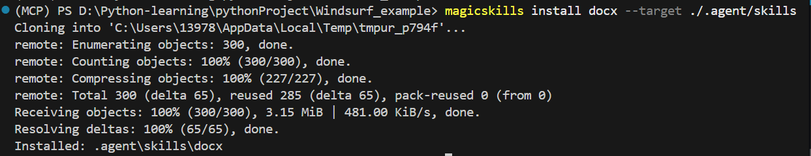
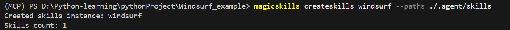
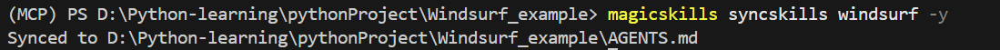
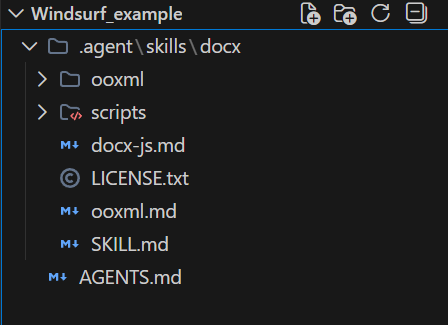
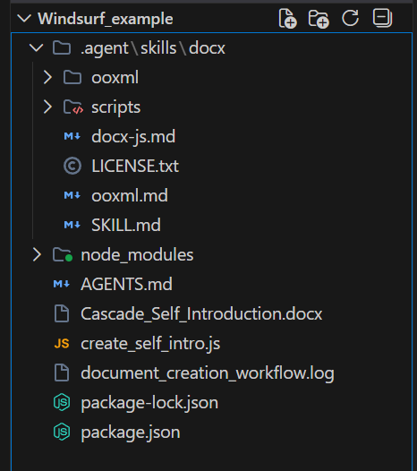

## 适配 Windsurf

首先 `git clone https://github.com/Narwhal-Lab/MagicSkills.git`

并执行  `pip install -e .` 指令

本文的示例 skill 以 **`docx`** 为例

打开你的 Windsurf 的工作目录，

### 安装 skill

执行 `magicskills install docx --target ./.agent/skills`

### 注册 skills

执行 `magicskills createskills windsurf --paths ./.agent/skills`

### 生成 AGETNS.md

执行 `magicskills syncskills windsurf --output ./AGENTS.md -y`

或者直接 `magicskills syncskills windsurf -y`

最后应有如下文件

### 使用

配置好上述文件后，windsurf 就具备了生成 docx 文档的能力

例如你可以输入 ： “请你读取当前目录下的AGENTS.md，生成一份自我介绍，保存在 .docx 文档中，你生成文档的工作流也要记录在 .log 文件中  ”

### 结果如下

